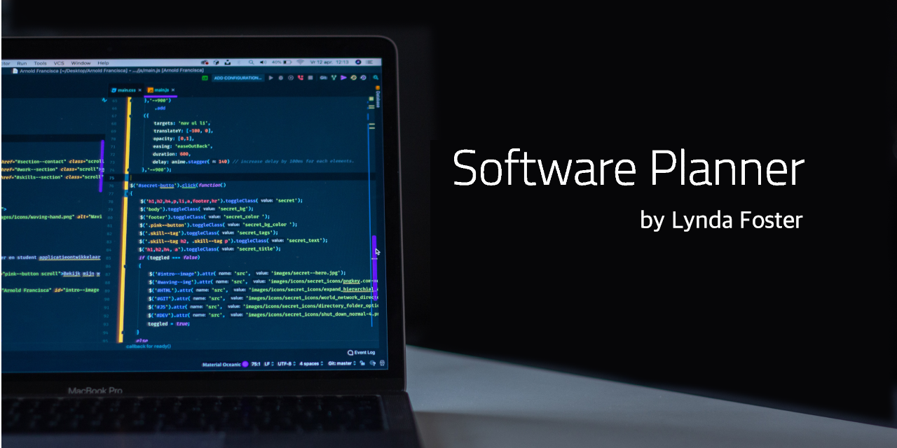

# Software Planner

A tool that enables developers to design software applications, manage requirements, track progress, and meet deadlines. 

Integrated tracking system make projects trackable and allows users to achieve target metrics. Teams and Role features allow groups of developers to collaborate throughout the software development life cycle.

Implements identity and role based access/rendering. SOLID principles demonstrated via object and record data structures. 

## WALKTHROUGH

- Teams
- Roles
- Project (Name, Summary, Requirements)
- Scope
- Tasks

- Projected Issues
- Issues & Notes (once project begins)
- Attachments
- History of changes
- Comments
- Target Dates / Priority

## OPEN REQUIREMENTS

- User login / registration
- Assigned role (assign/unassign for admins)
- Create projects
- Modify projects
- Delete projects
- Propose modifications to projects
- Create Notes
- Create Issues
- Assign notes/issues to teams, roles, users (notification setting?)
- Project statistics (timeline options)
- Sort / Search / Filtering
- Option to export project data to a csv file

## USER INTERFACE

- Landing (login/registration)
- Dashboard

- Profile
- Role
- Projects
- Assigned Issues

- Profile Management
- Role Management
- Project Management
- Issue Management

### LOGIC DESIGN

- Identity access
- Role based security
- Role based rendering
- Tracking for:
	- requirements
	- tasks
	- issues

### DATA DESIGN

- User - str
- Team - str
- Project - str
- Tasks - list<tasks>

- Priority - str
- Status - str
- Notification - str
- History - str

- Notes / Issues
	- Type - str
	- Attachments - file
	- Comments / Updates - str
	- Date - datetime

